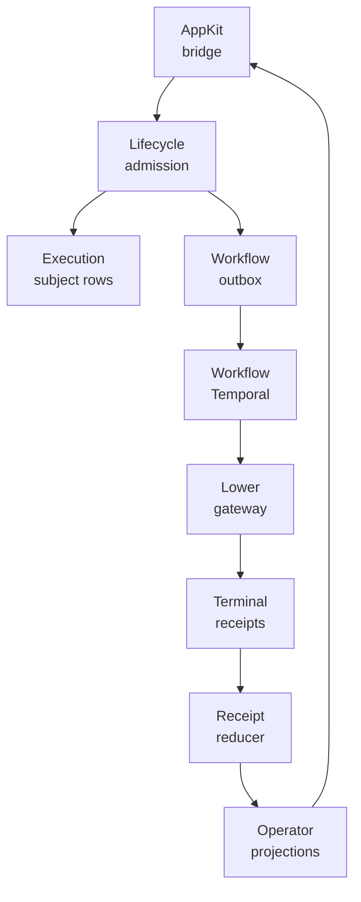
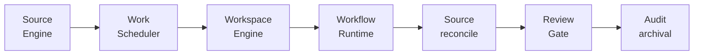
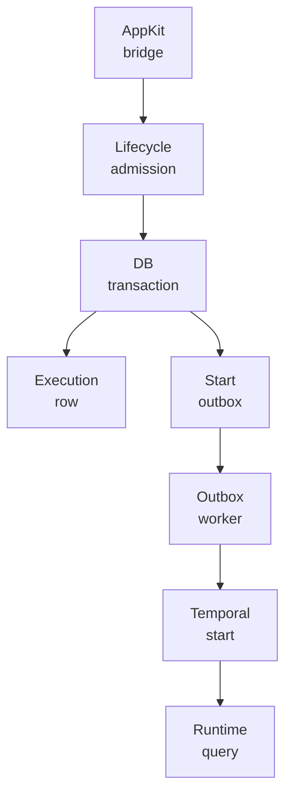
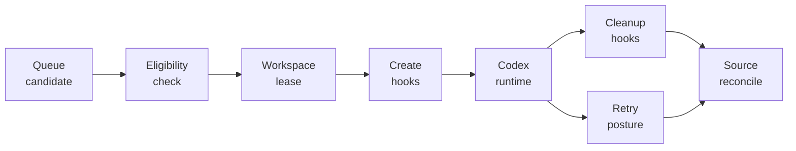

<p align="center">
  
</p>

<p align="center">
  <a href="https://github.com/nshkrdotcom/mezzanine">
    
  </a>
  <a href="https://github.com/nshkrdotcom/mezzanine/blob/main/LICENSE">
    
  </a>
</p>

# Mezzanine

Mezzanine is the neutral high-level reusable monorepo behind the nshkr
product stack.

It is the place for generalized business semantics, configurable operational
engines, Ash-shaped domain logic, and reusable application-layer machinery that
should not live in product repos like `extravaganza` and should not be forced
down into lower infrastructure layers like `app_kit`, `citadel`, or
`jido_integration`.

## Current Layout

```text
mezzanine/
  build_support/       # workspace and Weld manifests
  core/mezzanine_core  # projected artifact shell over the neutral rebuild
  core/substrate_model # pure generic operation, envelope, receipt, and graph DTOs
  core/agent_turn_engine # pure native agent turn ledger, replay, cursor, and pending DTOs
  core/pack_model      # neutral pack definitions and shared structs
  core/pack_compiler   # neutral pack compilation and validation
  core/lifecycle_engine # durable lifecycle coordinator over explicit execution requests
  core/config_registry # deployment/install registry seam
  core/source_engine   # neutral source admission and dedupe contracts
  core/object_engine   # subject/object lifecycle engine scaffold
  core/workspace_engine # neutral workspace lease, hook, cleanup, and path-safety contracts
  core/execution_engine
  core/runtime_scheduler
  core/workflow_runtime
  core/decision_engine
  core/evidence_engine
  core/projection_engine
  core/operator_engine
  core/adaptive_control_engine
  core/optimization_engine
  core/context_packet_engine
  core/ai_execution_engine
  core/coordination_engine
  core/audit_engine
  core/archival_engine
  core/ops_*           # live semantic hosts pending later neutral rename
  bridges/citadel_bridge
  bridges/integration_bridge
  docs/                # repo-level architecture and publication docs
```

## Scope

- reusable business-semantic engines
- configuration-driven operational machinery
- high-level workflow and policy composition
- generalized models for distributed AI operations
- product-neutral logic above `app_kit`

## Implementation Notes

Maintainers should read
[Code Smell Remediation](https://github.com/nshkrdotcom/mezzanine/blob/main/guides/code_smell_remediation.md) before changing
pack compiler support, workflow normalization, runtime state ownership,
cache invalidation, runtime configuration, or workspace command execution.

## Current Operational Surface

Mezzanine is the reusable operating layer that now makes the product loop real.
It is not a UI repo and it is not a connector SDK. Its job is to hold the
durable, product-neutral engines that connect AppKit-facing product commands to
Citadel governance, Jido Integration runtime execution, source admission,
workspace lifecycle, reviews, evidence, projections, audit, and recovery.

The current runtime path is assembled from these neutral surfaces:

- `Mezzanine.AppKitBridge` exposes the product-safe bridge consumed by AppKit
  and keeps product repos out of lower internals.
- `Mezzanine.WorkControl`, work surfaces, operator surfaces, and review
  surfaces coordinate submit, refresh, pause, resume, cancel, accept, reject,
  rework, waive, expire, and readback flows.
- `Mezzanine.CitadelBridge` hands governed work into Citadel authority without
  moving Brain governance ownership into product code.
- `Mezzanine.IntegrationBridge` hands lower execution and lower-facts reads to
  Jido Integration with tenant scope and typed read leases.
- `Mezzanine.WorkflowRuntime` owns Temporal-backed execution handoff, workflow
  start outbox processing, compact workflow evidence, and runtime dispatch
  activities.
- `Mezzanine.AgentTurnEngine` owns native agent ledger, event, replay, cursor,
  and pending-interaction truth as pure refs and reducers before store adapters
  or workflow integration.
- `Mezzanine.ContextPacketEngine` owns durable admission receipts for
  OuterBrain Context ABI packets after Citadel authority and budget checks.
- `Mezzanine.AIExecution` owns TRINITY/GEPA adapter behaviours and the
  rendered-prompt handoff from OuterBrain refs into Jido Integration model
  invocation requests.
- `Mezzanine.ExecutionLifecycleWorkflow` and lifecycle reducers keep execution
  rows, subject state, decisions, evidence, projections, source reconciliation,
  and audit ledgers coherent as lower receipts arrive.
- `Mezzanine.WorkScheduler` owns queue capacity, candidate eligibility,
  pre-dispatch revalidation, retry due times, failure backoff, stale token
  defense, and startup/running reconciliation.
- `Mezzanine.WorkspaceEngine` owns workspace key contracts, root containment,
  create/before-run/after-run/before-remove/cleanup hooks, and cleanup
  continuation after hook failures.

Recent buildout has made the coding-agent loop observable from above without
letting products bypass the reusable engines. Mezzanine now projects coding
runtime session start and stop receipts, app-server protocol evidence,
first-prompt evidence, continuation-turn evidence, event-stream evidence,
runtime stall decisions, token accounting totals, and terminal workspace
cleanup into the product read models. It also carries issue-tracker candidate
team filters, current source telemetry, dynamic source-tool execution,
state-publication variants, publication dry-run denial, proposed-change
evidence runtime, source blocker dispatch denial, and source payload readback.

The Extravaganza cutover proof exercised these paths through binding-selected
provider adapters for Linear source/current-state/publication/GraphQL, Codex
runtime turns, and GitHub evidence/cleanup. Those provider terms are lower
adapter and receipt facts. The generic Mezzanine path routes by pack, binding,
authority, credential lease, manifest, and receipt refs rather than by
provider-named product calls.

The Synapse governed-effect lift adds the minimal product-neutral
governed-effect core under `core/governed_effects`. Its public owner is
`Mezzanine.Core.GovernedEffects`, with `GovernedEffect`, `AuthorityPacket`,
`EffectReceipt`, `TransitionGate`, `EffectLog`, `Projection`, `DiagnosticWorkflow`,
and `Coordinator` modules. The coordinator is the narrow cross-stack path for a
diagnostic effect: build or accept a command envelope, authorize through
Citadel, dispatch through Jido Integration, receive the Execution Plane
diagnostic result, reduce the receipt, and project the timeline for AppKit
readback. Product repos consume this through AppKit, not by importing these
modules directly.

The Synapse conformance receipt is produced from StackLab:

```bash
cd /home/home/p/g/n/stack_lab
MIX_ENV=test mix stack_lab.synapse.staged_live.v1 --json
```

That is the core accomplishment of the current repo: Mezzanine has enough
neutral engines for a product to submit governed coding work, dispatch it
through the lower runtime, track the workspace and source lifecycle, reduce
receipts into operator-visible projections, handle retries and cleanup, and
present review/evidence state through AppKit. The implementation is still
deliberately neutral. Extravaganza owns product defaults and operator copy;
Jido Integration owns connector and runtime adapter behavior; Citadel owns
governance compilation; Execution Plane owns the lower node/lane substrate.

## Runtime Owner Model

Mezzanine treats runtime state as owned, typed, and replayable:

- products provide installation, pack, source, and work intent through AppKit
- source admission turns provider objects into tenant-scoped subjects without
  making provider payloads durable product truth
- lifecycle admission writes durable execution state and explicit workflow-start
  outbox rows in the same transaction
- WorkflowRuntime dispatches to Temporal and lower gateway activities while
  preserving compact evidence instead of raw workflow history
- terminal receipts are reduced into stable execution, subject, decision,
  evidence, projection, and audit ledgers
- review gates update subject state and projection state through the same
  reducer path instead of ad hoc product mutations

This owner model is why the product can show usable queue, runtime, source,
review, evidence, retry, and cleanup readback without importing lower repo
internals.

## Runtime Diagrams





## Developer Flow Diagrams





## Status

The active buildout in this repo is the neutral core scaffold:

- `core/substrate_model`
- `core/agent_turn_engine`
- `core/pack_model`
- `core/pack_compiler`
- `core/lifecycle_engine`
- `core/config_registry`
- `core/source_engine`
- `core/object_engine`
- `core/workspace_engine`
- `core/execution_engine`
- `core/runtime_scheduler`
- `core/decision_engine`
- `core/evidence_engine`
- `core/projection_engine`
- `core/operator_engine`
- `core/adaptive_control_engine`
- `core/optimization_engine`
- `core/coordination_engine`
- `core/audit_engine`
- `core/archival_engine`

The `ops_*` packages still host live semantic domains.
They remain frozen to current consumers while later phases move those semantics
into neutral packages with current naming.

Current posture:

- new reusable substrate work lands in the neutral package graph
- persistence-aware engines default to `:mickey_mouse` memory stores through
  package-local facades; durable Postgres/AshPostgres and WorkflowRuntime SQL
  paths are explicit opt-in and fail preflight without migration proof
- source admission and workspace path-safety contracts are now neutral
  packages (`core/source_engine` and `core/workspace_engine`); provider calls
  remain below Mezzanine, and product source defaults remain above it
- accepted lifecycle transitions now persist the execution row, typed
  workflow-start outbox row, and Oban dispatch job in the same database
  transaction; the lifecycle engine carries only refs, hashes, deterministic
  workflow identity, and idempotency keys, while Temporal client code remains
  isolated in `Mezzanine.WorkflowRuntime`
- durable dispatch ownership now belongs to `Mezzanine.WorkflowRuntime`
  workflow handoff contracts plus lower-gateway activities; Oban remains only
  for the explicit WorkflowRuntime outbox and local GC queues
- terminal lower receipts are reduced by `Mezzanine.Projections.ReceiptReducer`
  into execution, subject, decision, evidence, projection, and audit ledgers;
  `SourceReconciliation` handles terminal source drift, missing/reassigned
  source objects, blockers, stale polls, and out-of-band updates; and
  `ReviewGate` applies accept/reject/waive/expire/escalate decisions into
  subject state plus review/rework/escalation projections
- lower-facts reads are tenant-scoped at both lease authorization and
  Jido Integration substrate-read boundaries; `Mezzanine.Leasing` checks the
  caller-carried authorization scope before token validation, and
  `bridges/integration_bridge` forwards only typed `TenantScope` reads to the
  lower store
- control-room incident bundles now use
  `Mezzanine.ControlRoom.IncidentBundle` to carry compact tenant, authority,
  trace, workflow, lower-fact, semantic, projection, staleness, and release
  references without embedding raw workflow history or lower/provider payloads
- incident export bundles now use
  `Mezzanine.ControlRoom.IncidentExportBundle` to carry redacted export,
  redaction-manifest, checksum, operator, tenant, authority, trace, and
  release-manifest evidence without embedding raw workflow history, lower
  payloads, provider bodies, prompts, artifacts, or tenant-sensitive secrets
- forensic replay now uses `Mezzanine.ControlRoom.ForensicReplay` to carry
  compact ordered event refs, integrity hash, missing-ref set, replay result,
  tenant, authority, trace, and release-manifest evidence without embedding raw
  workflow history, lower payloads, provider bodies, prompts, artifacts, or
  tenant-sensitive secrets
- internal/operator pack authoring enters through deterministic
  `Mezzanine.Authoring.Bundle` imports; the config registry validates
  checksum/schema posture, policy refs, binding descriptors, lifecycle hints,
  trusted context adapter descriptors, and stale installation revision before
  runtime activation. Authoring bundles are verified by checksum/schema
  validation in v1 unless Phase 1 source-verifies signing/signature-verification
  modules and tests or Phase 7 implements signing. Signature verification is a
  post-v1/new-contract candidate until then.
- the remaining `ops_*` packages are explicit semantic-host carryovers, not a
  reusable extension surface

## Development

The workspace targets Elixir `~> 1.19` and Erlang/OTP `28`.

```bash
mix deps.get
mix ci
```

## Public API And Guides

The supported public Elixir API surfaces are listed in
[docs/public_api.md](docs/public_api.md). Start with the guide index for the
runtime flow, boundary rules, and local acceptance commands:

- [Guides index](docs/guides/index.md)
- [Runtime stack overview](docs/guides/runtime_stack_overview.md)
- [Work control run lifecycle](docs/guides/work_control_run_lifecycle.md)
- [Citadel authority compilation](docs/guides/citadel_authority_compilation.md)
- [Governed lower dispatch](docs/guides/governed_lower_dispatch.md)
- [Workflow runtime and execution lifecycle](docs/guides/workflow_runtime_and_execution_lifecycle.md)
- [Receipts and projections](docs/guides/receipts_and_projections.md)
- [AppKit and product boundary](docs/guides/appkit_and_product_boundary.md)
- [Local acceptance with StackLab](docs/guides/local_acceptance_with_stacklab.md)

## Temporal developer environment

Temporal runtime development is managed from this repository through the
repo-owned `just` workflow. Do not start ad hoc Temporal processes or rely on
the `temporal` CLI as the implementation runbook.

## Native Temporal development substrate

Temporal runtime development is managed from `/home/home/p/g/n/mezzanine` through the repo-owned `just` workflow, not by manually starting ad hoc Temporal processes.

Use:

```bash
cd /home/home/p/g/n/mezzanine
just dev-up
just dev-status
just dev-logs
just temporal-ui
```

Expected local contract: `127.0.0.1:7233`, UI `http://127.0.0.1:8233`, namespace `default`, native service `mezzanine-temporal-dev.service`, persistent state `~/.local/share/temporal/dev-server.db`.

## Persistence Documentation

See `docs/persistence.md` for tiers, defaults, adapters, unsupported selections, config examples, restart claims, durability claims, debug sidecar behavior, redaction guarantees, migration or preflight behavior, and no-bypass scope when applicable.

## gn-ten Implementation Guides

Mezzanine is the generalized operational engine layer. It owns lifecycle,
binding registry, pack compilation, workflow runtime, source admission,
workspace, evidence, projection, audit, and operator/review reducers for
product-neutral work.

Read these repo-specific guides before changing public contracts:

- [Generalized Stack Boundary](https://github.com/nshkrdotcom/mezzanine/blob/main/guides/generalized_stack.md)
- [QC And Operations](https://github.com/nshkrdotcom/mezzanine/blob/main/guides/qc_and_operations.md)

Operational rules:

- Public interfaces are owned by `core/substrate_model`, `core/pack_model`,
  `core/pack_compiler`, `core/config_registry`, lifecycle/runtime/source/
  workspace/evidence/projection/operator/review engines, and the explicit
  AppKit/Citadel/Jido bridge packages.
- Mezzanine may call Citadel and Jido Integration through bridge contracts. It
  must not own connector credentials, provider adapters, product copy, or lane
  execution internals.
- Provider words may appear in source payloads, binding data, receipts, traces,
  and adapter-facing facts. Generic engine APIs must use binding refs,
  operation classes, manifest refs, credential lease refs, and product-neutral
  subject kinds.
- GitHub or Linear live-provider checks belong to product or lower-adapter
  commands. When a Mezzanine path is exercised through such a command, prefix
  it with `~/scripts/with_bash_secrets`.
- Local development uses `mix deps.get`, `mix ci`, package-local tests, and the
  repo-owned `just dev-up` Temporal workflow when Temporal is required.
- Evidence is emitted through lifecycle/workflow/runtime tests, ConfigRegistry
  receipts, StackLab proofs, AITrace refs, projection receipts, and product
  acceptance runs that exercise Mezzanine through AppKit.

## Chassis Deployment Workflow

`Mezzanine.Workflow.ChassisDeploymentWorkflow` is the Truth/Workflow/Read
entry point for Chassis deployment intent. Mezzanine records the deployment
intent, coordinates workflow state, reduces Chassis receipts, and publishes
operator read projections. Chassis remains the substrate owner that performs
release placement, node mesh changes, host provisioning, health checks, and
rollback side effects.

The deployment workflow contract is documented in
`../j/jido_brainstorm/nshkrdotcom/docs/20260529/chassis_impl/0517_mezzanine_deployment_workflow_spec.md`.

## Chassis Evolution Workflows

Mezzanine owns the Chassis Evolution workflow layer and exposes the nine
workflow families specified for Chassis:

- `FailureBatchWorkflow`
- `CandidatePatchWorkflow`
- `TrialReplayWorkflow`
- `CandidateScoringWorkflow`
- `PromotionConsentWorkflow`
- `PromotionApplyWorkflow`
- `SwapRollbackWorkflow`
- `ModelMaterializationWorkflow`
- `TensorPatchReloadWorkflow`

Those workflows coordinate failure batches, candidate patch proposals, trial
replay, scoring, promotion consent, promotion apply, swap rollback, model
weight materialization, and tensor patch reload. They do not execute Docker,
systemd, SSH, or host swaps; those effects remain Chassis substrate actions.

The workflow catalogue is documented in
`../j/jido_brainstorm/nshkrdotcom/docs/20260529/chassis_impl/0530_chassis_evolution_mezzanine_workflows.md`.

## Truth / Workflow / Read Ownership For Chassis

Mezzanine owns Chassis Truth records such as `EvolutionIntentRecord`,
`FailureBatchIntent`, `CandidatePromotionIntent`, `OperatorConsentRecord`,
`ModelMaterializationIntent`, and `TensorReloadIntent`. It also owns read
projections such as `evolution_batch_projection`, `candidate_projection`,
`trial_projection`, `score_projection`, `swap_projection`, and model/tensor
operation readbacks.

Chassis owns substrate receipts and physical side effects. Mezzanine does not
run Docker, systemd, SSH, or host swaps.
